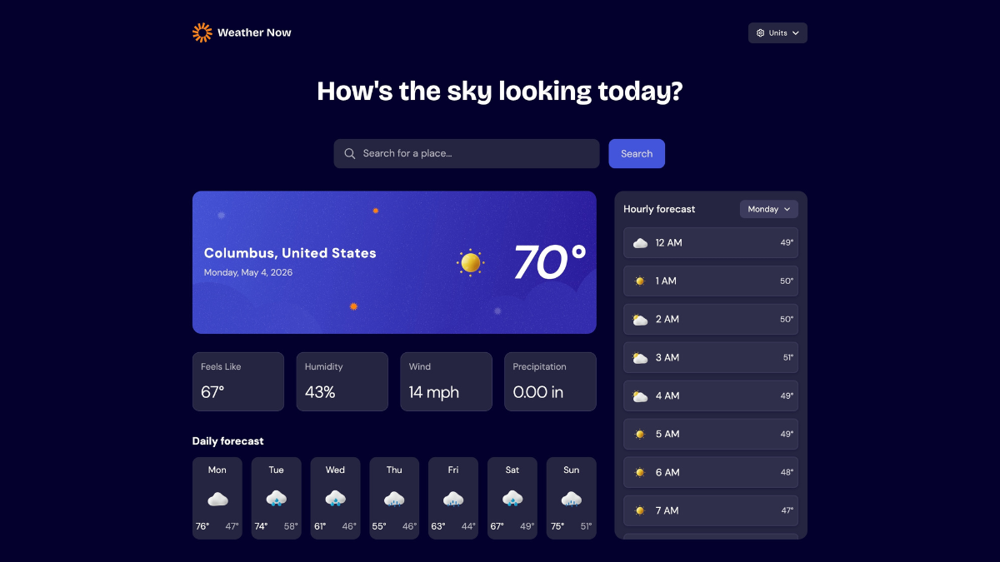
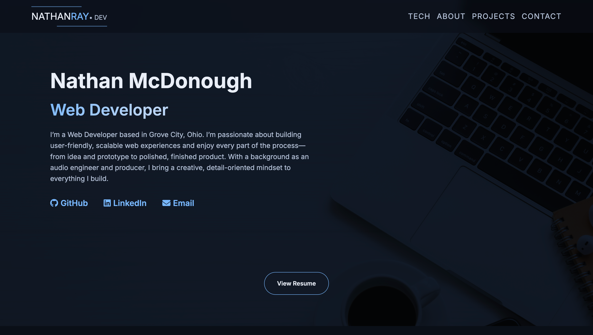
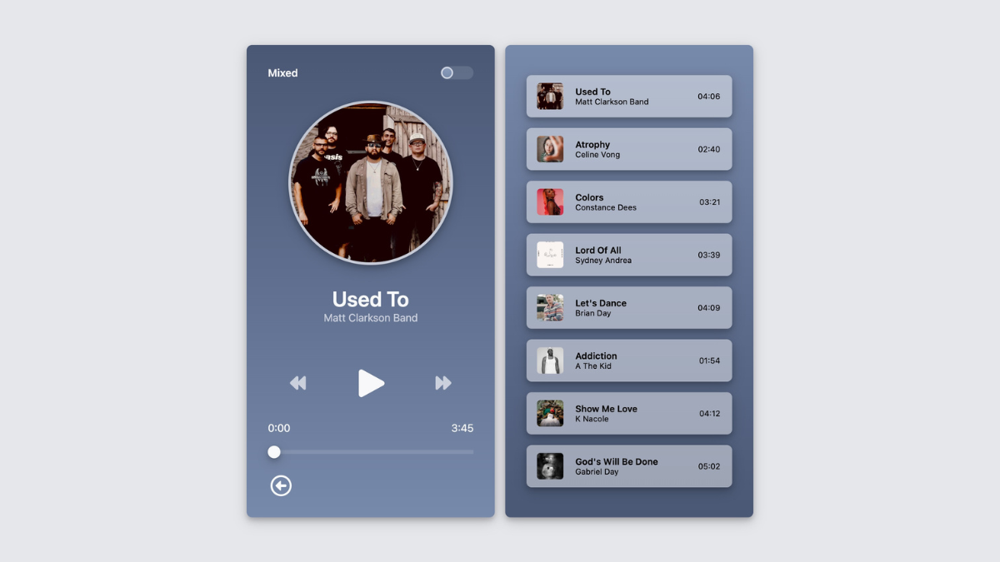
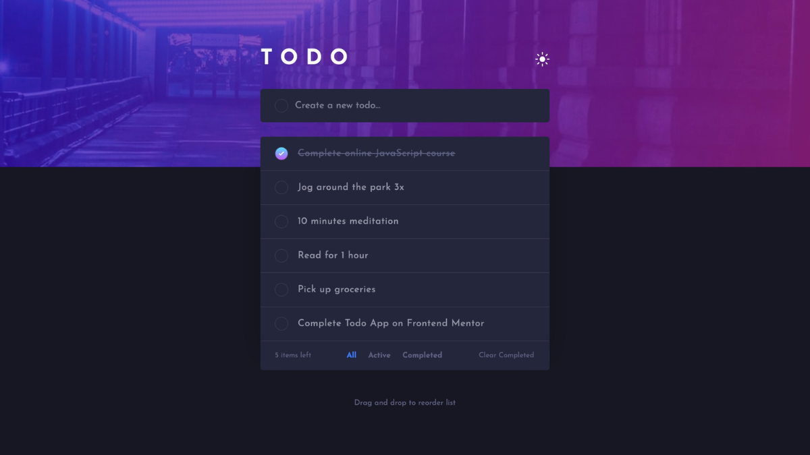

  

  
  
  
  

---

  
<h2>Projects</h2>

 

<table>
<tr>

<td width="50%" valign="top">

<h3 align="center">Weather App</h3>

  
  

<strong>HTML, CSS, JavaScript</strong> — Responsive weather dashboard with dynamic API data, unit conversion, and clean UI design.

</td>

<td width="50%" valign="top">

<h3 align="center">Portfolio Website</h3>

  
  

<strong>HTML, CSS, JavaScript</strong> — Modern responsive portfolio showcasing projects, accessibility, and clean UI layout.

</td>

</tr>

<tr>

<td width="50%" valign="top">

<h3 align="center">A/B Audio Player</h3>

  
  

<strong>JavaScript, HTML, CSS</strong> — Custom audio player with seamless source switching and persistent playback state.

</td>

<td width="50%" valign="top">

<h3 align="center">Task Manager</h3>

  
  

<strong>JavaScript, HTML, CSS</strong> — Task management app with dynamic DOM updates and local storage persistence.

</td>

</tr>

</table>

---

<h3 align="center">Technologies</h3>
<table align="center">
<tr>
<td align="center" width="100">
 HTML
</td>
<td align="center" width="100">
 CSS
</td>
<td align="center" width="100">
 JavaScript
</td>
<td align="center" width="100">
 React
</td>
<td align="center" width="100">
 Git
</td>
<td align="center" width="100">
 GitHub
</td>
</tr>
</table>

---
